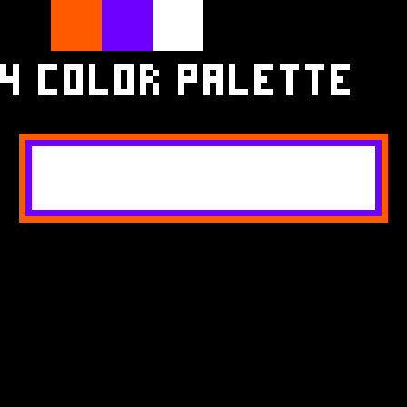
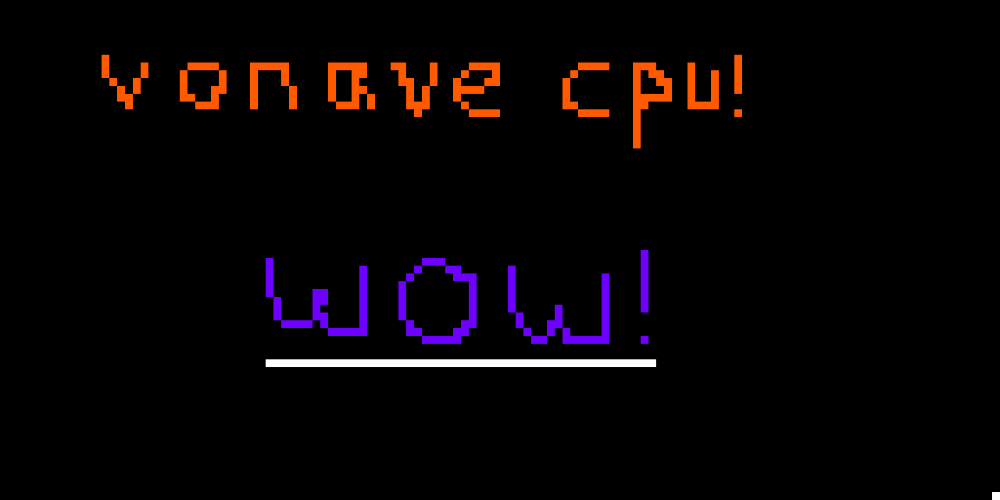

> ***vonave** /voʊ'nɑ-veɪ/*
> *noun*
>
> *1. the state of mind in which a person accepts that good things take time, and that meaningful events will happen when they need to.*

`vonave` is a variable-bit (2^(>=3)) fantasy computer, designed to work on any hardware with a `vonave` emulator.

## screenshots / videos

*fntest.vva: function test*

*4color.vva: palette display program*

*paint.vva: simple painting program*

